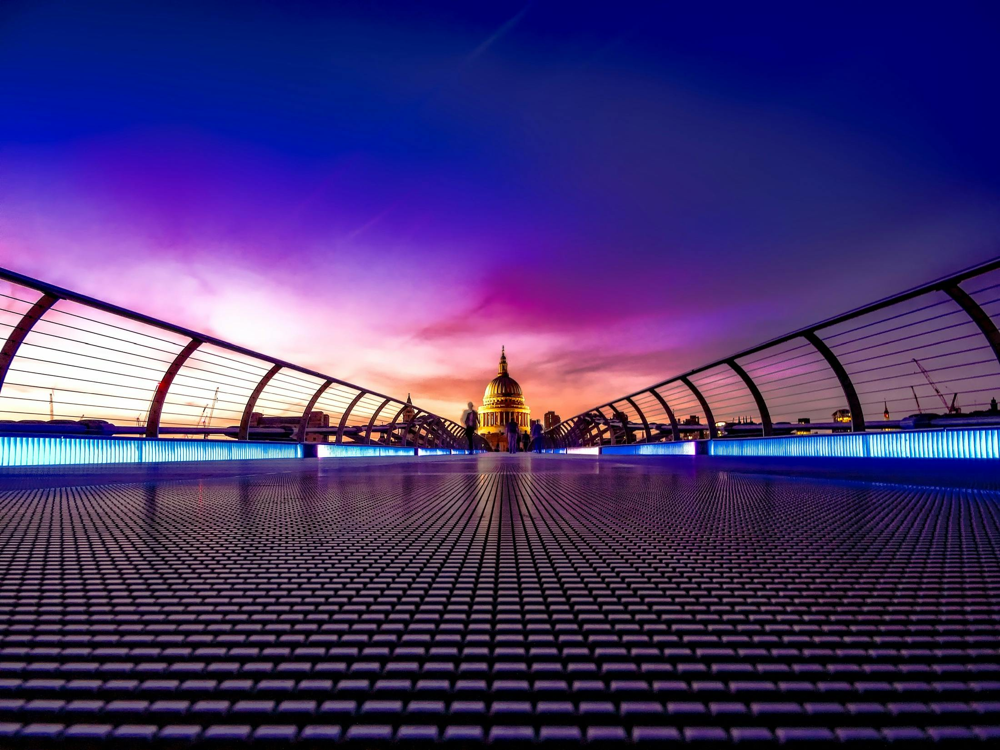
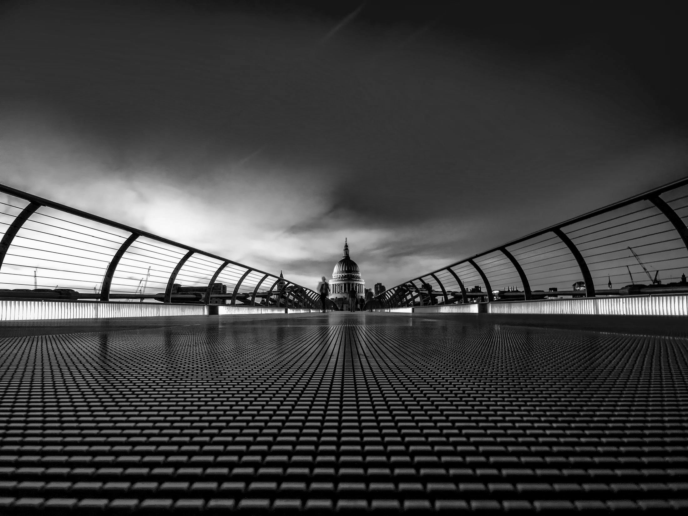

# Day 4: CUDA Image Processing - RGB to Grayscale & Image Blurring

---

### Overview

1. **RGB to Grayscale Conversion:** Convert a color image to grayscale by applying a weighted sum on the RGB channels.
2. **Image Blurring:** Apply a box blur filter to a grayscale image by averaging neighboring pixel values.

Both tasks utilize 2D grid and block configurations for parallel processing and demonstrate CUDA memory management and kernel launching.

---

### Part 1: RGB to Grayscale Conversion

**Objective:**  
- Convert an RGB image to grayscale.
- Learn to manage multiple color channels and apply the weighted formula:  
  `Gray = 0.21 x Red + 0.71 x Green + 0.07 x Blue`
- Utilize CUDA kernels with 2D grid and block configurations to process each pixel in parallel.

**Key Learnings:**  
- Allocating device memory for both the RGB input and grayscale output.
- Configuring 2D grids/blocks (e.g., 32×32 threads) to cover the entire image.
- Transferring data between host and device efficiently.
- Integrating CUDA kernels with Python using shared libraries for easy invocation.

**RGB to Grayscale Kernel:**  
```c
__global__ void RGB2Grayscale(unsigned char *rgb_img_in, unsigned char *gray_img_out, int img_w, int img_h) 
{
    int t_x = blockIdx.x * blockDim.x + threadIdx.x;
    int t_y = blockIdx.y * blockDim.y + threadIdx.y;

    int strideX = gridDim.x * blockDim.x;
    int strideY = gridDim.y * blockDim.y;

    if(t_x < img_w && t_y < img_h)
    {
        for (int i = t_x; i < img_w; i += strideX)
        {
            for (int j = t_y; j < img_h; j += strideY)
            {
                int grayOffset = j * img_w + i;
                int rgbOffset = grayOffset * CHANNELS;

                unsigned char r = rgb_img_in[rgbOffset];
                unsigned char g = rgb_img_in[rgbOffset + 1];
                unsigned char b = rgb_img_in[rgbOffset + 2];

                gray_img_out[grayOffset] = 0.21f * r + 0.71f * g + 0.07f * b;
            }
        }
    }
}
```
### Part 2: Image Blurring

**Objective:**
- Apply a box blur filter to a grayscale image.
- Process each pixel by averaging values in a neighborhood defined by `BLUR_SIZE` (resulting in a window of size `2 x BLUR_SIZE + 1`).
- Use strided loops within the kernel to cover the entire image and handle boundary conditions.

**Key Learnings:**
- Processing pixel neighborhoods in parallel.
- Handling image boundaries by checking valid indices.
- Efficiently transferring data between host and device.

**Image Blurring Kernel:**
```c
__global__ void imageBlur(unsigned char *img_in, unsigned char *img_out, int img_w, int img_h)
{
    int t_x = blockIdx.x * blockDim.x + threadIdx.x;
    int t_y = blockIdx.y * blockDim.y + threadIdx.y;

    int strideX = gridDim.x * blockDim.x;
    int strideY = gridDim.y * blockDim.y;

    for (int i = t_x; i < img_w; i += strideX)
    {
        for (int j = t_y; j < img_h; j += strideY)
        {
            int pix_val = 0;
            int n_pixels = 0;

            for (int row = -BLUR_SIZE; row <= BLUR_SIZE; row++)
            {
                for (int col = -BLUR_SIZE; col <= BLUR_SIZE; col++)
                {
                    int cur_row = j + row;
                    int cur_col = i + col;

                    if (cur_row >= 0 && cur_row < img_h && cur_col >= 0 && cur_col < img_w)
                    {
                        pix_val += img_in[cur_row * img_w + cur_col];
                        n_pixels++;
                    }
                }
            }

            img_out[j * img_w + i] = (unsigned char)(pix_val / n_pixels);
        }
    }
}
```

**Original Image:**


**Grayscale Image:**


**Blurred Image:**

